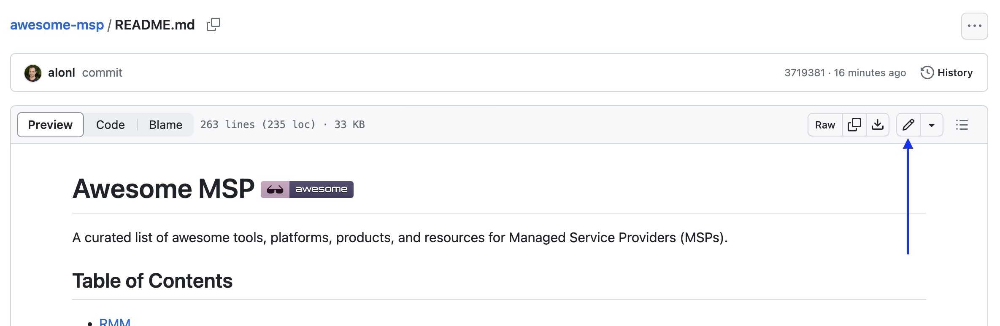
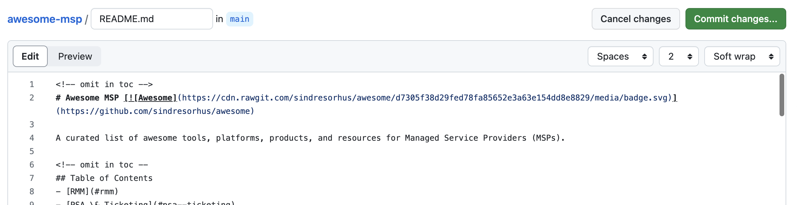

# Contributing Guidelines

Please note that this project is released with a [Contributor Code of Conduct](CODE_OF_CONDUCT.md). By participating in this project, you agree to abide by its terms.

## Table of Contents

- [Contributing Guidelines](#contributing-guidelines)
  - [Table of Contents](#table-of-contents)
  - [Pull Request Guidelines](#pull-request-guidelines)
  - [How to add to this list](#how-to-add-to-this-list)
  - [Updating your Pull Request](#updating-your-pull-request)

## Pull Request Guidelines

Please ensure your pull request adheres to the following guidelines:

- Search previous suggestions to make sure your suggestion isn't a duplicate.
- Make sure each list item is useful before adding it.
- Create individual pull requests/issues for each suggestion.
- Use [title-casing](http://titlecapitalization.com) (AP style) in the following format: `[List Name](link)`
- Link additions should be added in alphabetical order in the relevant category.
- New categories or changes to the existing categorization are welcome.
- Check your spelling and grammar.
- Make sure your text editor is set to remove trailing whitespace.
- The pull request and commit should have a useful title.
- Annotate your PR to clarify what you did if the diff is confusing.

Thank you for your suggestions!

## How to add to this list

If you have something awesome to contribute to this list, this is how you do it.

If you have a GitHub account:

1. Fork this repo.
2. Make changes under correct section in `README.md`
3. Update `Contents` (if applicable)
4. Commit and open a Pull Request

If you don't have a [GitHub account](https://github.com/join), make one!

1. Access the Awesome MSP's GitHub page: https://github.com/guardzcom/awesome-msp
2. Click on the `README.md` file.
3. Now click on the edit icon. 
4. You can start editing the text of the file in the in-browser editor. Make sure you follow guidelines above. You can use [GitHub Flavored Markdown](https://help.github.com/articles/github-flavored-markdown/). 
5. Say why you're proposing the changes, and then click on "Propose file change".
6. Submit the [pull request](https://help.github.com/articles/using-pull-requests/)!

## Updating your Pull Request

Sometimes, a maintainer will ask you to edit your Pull Request before it is included. This is normally due to spelling errors or because your PR didn't match the contributing guidelines.

[Here](https://github.com/RichardLitt/knowledge/blob/master/github/amending-a-commit-guide.md) is a write up on how to change a Pull Request, and the different ways you can do that.
